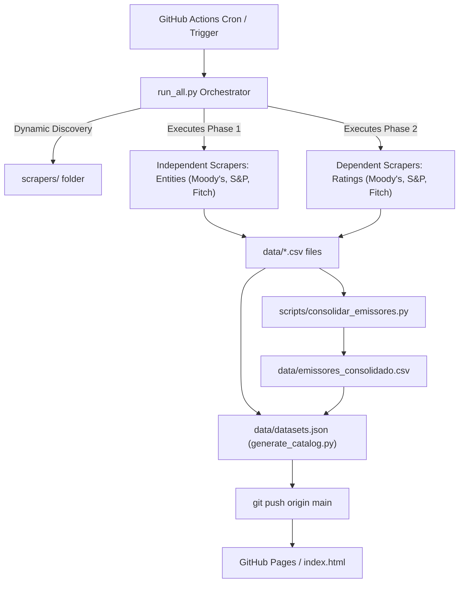

<p align="center">
  <a href="https://github.com/PulseDataLabs/PulseRatingsBrasil">
    
  </a>
</p>

<h1 align="center">Pulse Ratings Brasil</h1>

<p align="center">
  <strong>Pipeline Serverless e Automatizado de Captura de Ratings de Crédito Brasileiros</strong>
</p>

<p align="center">
  <a href="https://github.com/PulseDataLabs/PulseRatingsBrasil/actions/workflows/main.yml">
    
  </a>
  
  
  
  
</p>

<hr>

O **Pulse Ratings Brasil** é um pipeline de ETL (Extração, Transformação e Carga) serverless projetado para coletar, tratar e disponibilizar dados de ratings de crédito (corporativos e soberanos) das principais agências de classificação de risco em atuação no Brasil: **S&P**, **Moody's** e **Fitch**.

Ele funciona 100% de forma automatizada via **GitHub Actions**, salvando o histórico consolidado diretamente no repositório em formato CSV plano. Os dados tratados alimentam um dashboard interativo servido via **GitHub Pages**.

---

## 🚀 Recursos e Diferenciais

*   **Arquitetura Baseada em OOP**: Scrapers estruturados sob uma classe base infraestrutural (`BaseScraper`) que gerencia nativamente o ciclo de vida, sanitização de tipos e geração de logs.
*   **Deduplicação Inteligente**: A persistência em CSV mescla dados novos com antigos no mesmo dia, substituindo re-execuções sem duplicar linhas e mantendo o histórico intacto.
*   **Detecção de Schema Drift**: Alertas automáticos caso as colunas das tabelas originais fornecidas pelas agências mudem de layout.
*   **Catálogo Dinâmico**: Geração automatizada do catálogo de dados (`datasets.json`) e mapeamento de tipos de campos (`schemas.json`) a cada execução do pipeline.
*   **Dashboard Vanilla CSS/JS**: Uma interface web rápida e responsiva para buscar, filtrar por agência e baixar os arquivos CSV sem sobrecarga de frameworks pesados.

---

## 📐 Arquitetura do Pipeline



---

## 📂 Estrutura do Projeto

```
PulseRatingsBrasil/
├── .github/
│   └── workflows/
│       └── main.yml                 # Agendamento do pipeline no GitHub Actions
├── data/                            # Datasets, schemas e metadados de controle
│   ├── datasets.json                # Catálogo estruturado de metadados dos datasets
│   ├── schemas.json                 # Definição e mapeamento de campos e tipos
│   ├── pipeline_status.json / .js   # Logs de saúde e duração da última execução
│   ├── last_updates.json / .js      # Período de cobertura temporal de cada CSV
│   ├── emissores_consolidado.csv    # Emissores consolidados (1 linha por emissor + CNPJ)
│   └── *.csv                        # Séries temporais de ratings de crédito
├── tests/                           # Testes automatizados
│   ├── __init__.py
│   └── test_consolidar_emissores.py # Testes do script de consolidação
├── scrapers/                        # Módulos de captura
│   ├── utils/
│   │   ├── __init__.py
│   │   └── base.py                  # Classe base BaseScraper
│   └── *.py                         # Scripts de coleta (duplas emissores/ratings por fonte)
├── utils/                           # Utilitários compartilhados auxiliares
│   ├── __init__.py
│   ├── base.py                      # Salvamento de CSVs e helpers HTTP
│   └── parsers.py                   # Parsers auxiliares para formatos especiais
├── scripts/                         # Scripts de ciclo de vida
│   ├── consolidar_emissores.py      # Consolida emissores das 3 agências em 1 CSV
│   ├── generate_catalog.py          # Gerador automatizado do catálogo de datasets
│   ├── preencher_cnpj_cvm.py        # Preenche CNPJ via dados offline da CVM
│   ├── preencher_cnpj_api.py        # Preenche CNPJ via CNPJ Aberto API (1.000 req/dia)
│   ├── preencher_cnpj_rfb.py        # Preenche CNPJ via base local da Receita Federal
│   └── utils/
│       ├── __init__.py
│       └── ux.py                    # Utilitários de UX (cores, ícones, progresso)
├── run_all.py                       # Orquestrador CLI central do projeto
├── requirements.txt                 # Dependências do Python
├── .env.example                     # Template de variáveis de ambiente
├── index.html                       # Dashboard estático do projeto
└── README.md
```

---

## 💻 Guia do Desenvolvedor

### Instalação Local

1.  **Clone o repositório:**
    ```bash
    git clone https://github.com/PulseDataLabs/PulseRatingsBrasil.git
    cd PulseRatingsBrasil
    ```

2.  **Instale as dependências:**
    ```bash
    pip install -r requirements.txt
    ```

3.  **Configure o arquivo de variáveis de ambiente:**
    ```bash
    cp .env.example .env
    ```
    *(Edite o `.env` caso precise definir chaves de API, como `SP_GLOBAL_API_KEY`, caso queira evitar o fallback dinâmico).*

### Executando os Scrapers

*   **Executar todos os scrapers ativos:**
    ```bash
    python run_all.py
    ```

*   **Executar sequencialmente (ideal para depuração):**
    ```bash
    python run_all.py --sequential
    ```

*   **Executar apenas um scraper específico:**
    ```bash
    python run_all.py --scraper moodys_ratings
    ```

*   **Regenerar apenas o catálogo `datasets.json`:**
    ```bash
    python run_all.py --generate-catalog
    ```

### Preenchimento de CNPJ

O campo `cnpj_emissor` do consolidado é preenchido por 3 scripts, executados em ordem:

| Script | Fonte | Onde roda | Limitação |
|--------|-------|-----------|-----------|
| `preencher_cnpj_cvm.py` | CVM (cias abertas + fundos) | GitHub Actions (automático) | ~400-500 matches |
| `preencher_cnpj_api.py` | [CNPJ Aberto API](https://cnpjaberto.com) | GitHub Actions (automático) | 1.000 req/dia free |
| `preencher_cnpj_rfb.py` | Receita Federal (base completa) | **Local apenas** | ~500MB download |

**RFB (local):**
```bash
# 1. Baixar o DADOS_ABERTOS_CNPJ.zip manualmente (~500MB)
#    Fonte: https://dados.gov.br/dados/conjuntos-dados/cadastro-nacional-da-pessoa-juridica---cnpj

# 2. Salvar no diretório de cache:
mkdir -p data/rfb_cache
cp ~/Downloads/DADOS_ABERTOS_CNPJ.zip data/rfb_cache/

# 3. Executar:
python scripts/preencher_cnpj_rfb.py

# Para recriar o banco SQLite do zero (útil após atualizar o zip):
python scripts/preencher_cnpj_rfb.py --rebuild-db
```

O script da RFB constrói um banco SQLite local com índice de nomes normalizados,
permitindo busca exata e fallback por palavras significativas.

---

## 🧩 Grupos de Scrapers

O orquestrador `run_all.py` organiza os scrapers em grupos. Este repositório contém scrapers de múltiplos domínios:

| Grupo | Descrição | Scrapers |
|-------|-----------|----------|
| `ratings` | Ratings de crédito (S&P, Moody's, Fitch) | `standard_and_poors_ratings`, `standard_and_poors_emissores`, `moodys_ratings`, `moodys_emissores`, `fitch_ratings`, `fitch_emissores` |
| `consolidated` | Emissores consolidados (1 linha por emissor) | `emissores_consolidado` |
| `anbima` | Dados ANBIMA | *(implementação externa)* |
| `b3` | Dados B3 | *(implementação externa)* |
| `bcb` | Dados Banco Central | *(implementação externa)* |
| `cvm` | Dados CVM | *(implementação externa)* |
| `ibge` | Dados IBGE | *(implementação externa)* |
| `misc` | Outras fontes | *(implementação externa)* |

Apenas o grupo `ratings` está ativo por padrão neste repositório público.

---

## 📡 Fontes de Dados

### S&P
- **Tipo:** Scraper web com extração dinâmica de chave pública
- **Autenticação:** Opcional (`SP_GLOBAL_API_KEY`). Sem a chave, o scraper extrai a chave pública dinamicamente.
- **Dados coletados:** Ratings de emissor e lista de emissores
- **Frequência:** Cada execução do pipeline

### Moody's
- **Tipo:** Planilhas Excel (.xlsx) e dados estruturados
- **Autenticação:** Pública (sem chave)
- **Dados coletados:** Ratings de emissor e lista de emissores
- **Frequência:** Cada execução do pipeline

### Fitch
- **Tipo:** API GraphQL pública
- **Autenticação:** Pública (sem chave)
- **Dados coletados:** Ratings de emissor e lista de emissores
- **Frequência:** Cada execução do pipeline

---

## 📊 Schema dos Dados

Cada arquivo CSV segue o padrão: **UTF-8**, separador **vírgula**, decimal **ponto**, datas **YYYY-MM-DD**.

Os campos comuns a todos os datasets:

| Campo | Tipo | Descrição |
|-------|------|-----------|
| `dt_captura` | date | Data da captura pelo pipeline |
| `no_entidade` | str | Nome do emissor |

O dataset `emissores_consolidado.csv` possui estrutura própria:

| Campo | Tipo | Descrição |
|-------|------|-----------|
| `nome_emissor_padronizado` | str | Nome normalizado (uppercase, sem acentos, sem sufixos) |
| `nome_emissor_fitch` | str | Nome original na fonte Fitch |
| `nome_emissor_moodys` | str | Nome original na fonte Moody's |
| `nome_emissor_standard_and_poors` | str | Nome original na fonte S&P |
| `cnpj_emissor` | str | CNPJ do emissor (preenchido via CVM + CNPJ Aberto API + base RFB) |

As definições completas de campos e tipos são geradas automaticamente em [`data/schemas.json`](data/schemas.json) a cada execução e exibidas no [dashboard](https://pulsedatalabs.github.io/PulseRatingsBrasil/).

---

## 🤝 Como Contribuir

1. Faça um **fork** do repositório
2. Crie uma **branch** para sua feature: `git checkout -b minha-feature`
3. Faça o **commit** das alterações: `git commit -m "feat: descrição concisa"`
4. Envie para o **remote**: `git push origin minha-feature`
5. Abra um **Pull Request**

### Convenções
- Commits seguem [Conventional Commits](https://www.conventionalcommits.org/)
- Código Python segue [PEP 8](https://peps.python.org/pep-0008/)
- Docstrings no formato Google style

---

## ❓ Troubleshooting

| Problema | Causa | Solução |
|----------|-------|---------|
| S&P retorna dados vazios | Chave pública expirada ou bloqueada | Executar novamente — o scraper tenta extrair nova chave automaticamente |
| Schema drift alerta | Agência modificou colunas do layout | Revisar o drift em `pipeline_status.json` e atualizar se necessário |
| Pipeline timeout no GH Actions | Execução excede 6h | Verificar scraper específico com `--sequential` localmente |
| Erro `xlrd.biffh.XLRDError` | Arquivo Excel no formato `.xlsx` | O fallback para `openpyxl` é automático |

---

## 📋 Changelog

### 2026-06
- Padronização do campo de captura para `dt_captura`
- Dashboard com busca, filtros e schema dinâmico
- Suporte a 6 datasets de ratings (3 agências × ratings + emissores)
- Detecção automática de schema drift
- Consolidação de emissores: script + testes + dataset `emissores_consolidado.csv`
- Sistema de UX unificado (cores, progresso, logging) nos scrapers e orquestrador

### 2026-05
- Pipeline inicial com scrapers S&P, Moody's e Fitch
- Schema drift detection
- Catálogo dinâmico de datasets

---

## 🔒 Segurança

Para reportar vulnerabilidades, abra uma [issue](https://github.com/PulseDataLabs/PulseRatingsBrasil/issues) com o label `security` ou entre em contato pelo GitHub.

---

## 📄 Licença

Este projeto está sob a licença MIT. Consulte o arquivo [LICENSE](LICENSE) para obter mais detalhes.

Desenvolvido com 💙 por **[PulseDataLabs](https://github.com/PulseDataLabs)**.

---

<p align="center">
  <sub>Dados públicos de rating — S&P, Moody's e Fitch</sub>
</p>
