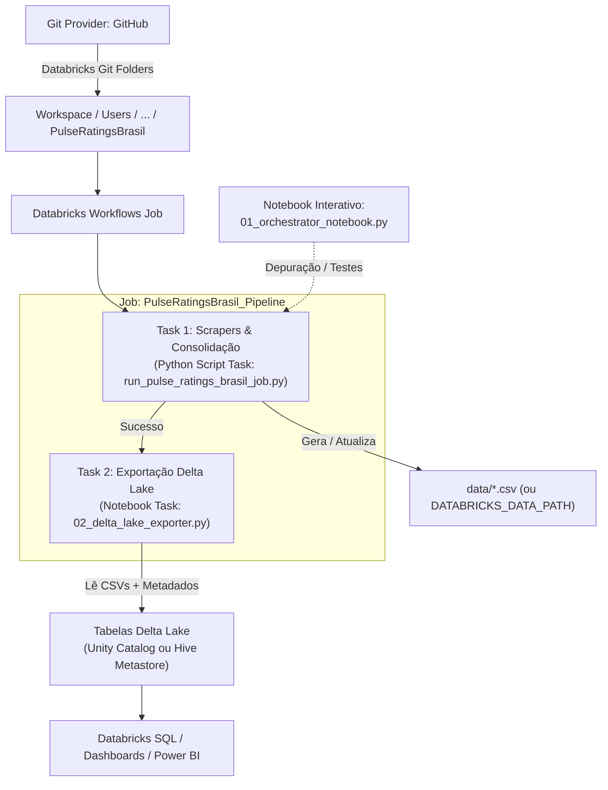

# 🚀 Guia de Integração e Execução no Databricks

Este guia orienta passo a passo como configurar, orquestrar e depurar o **Pulse Ratings Brasil** no Databricks utilizando exclusivamente os recursos nativos de **Git Folders (Repos)** e **Databricks Workflows (Jobs UI)**, sem necessidade de Databricks Asset Bundles (DABs), CLI especializada ou permissões de administrador.

---

## 📐 Arquitetura da Solução



---

## 📂 Estrutura de Arquivos Databricks

```text
databricks/
├── notebooks/
│   ├── 01_orchestrator_notebook.py    # Notebook interativo com widgets para testes e depuração
│   └── 02_delta_lake_exporter.py      # Notebook para conversão de CSVs para tabelas Delta Lake
├── run_pulse_ratings_brasil_job.py    # Entrypoint oficial para Python Script Tasks nos Workflows
├── delta_exporter.py                  # Módulo utilitário reutilizável de carga para Delta Lake
├── run_pipeline.py                    # Wrapper de compatibilidade
├── requirements.txt                   # Dependências Python recomendadas para o cluster
├── init.sh                            # Script de inicialização (instalação de curl-cffi nativo)
└── README.md                          # Este guia completo
```

---

## 1. Conectar o Repositório via Git Folders (Repos)

O recurso **Git Folders** permite clonar e manter sincronizado o repositório diretamente no Databricks Workspace.

### Passo 1.1: Configurar Credenciais do Git (PAT)
1. No Databricks, clique no seu usuário (canto superior direito) e selecione **Settings** (Configurações).
2. No menu lateral, acesse **Linked accounts** (ou **Developer / Git integration** dependendo da versão do Databricks).
3. Em **Git provider**, selecione **GitHub**.
4. Insira seu nome de usuário do GitHub e um **Personal Access Token (PAT)** com permissões de `repo` (leitura/escrita).
5. Clique em **Save**.

### Passo 1.2: Clonar o Repositório
1. No menu lateral esquerdo do Databricks, acesse **Workspace** > **Users** > `<seu-usuario>`.
2. Clique com o botão direito na pasta do seu usuário ou no botão **Add** > **Git folder** (ou **Repo**).
3. Preencha as configurações:
   - **Git repository URL:** `https://github.com/PulseDataLabs/PulseRatingsBrasil.git`
   - **Git provider:** `GitHub`
   - **Git folder name:** `PulseRatingsBrasil`
4. Clique em **Create Git folder**.
5. O repositório será clonado e ficará acessível em:
   `/Workspace/Users/<seu-usuario>/PulseRatingsBrasil`

---

## 2. Configurar Segredos e Variáveis de Ambiente

O pipeline é 100% flexível: pode ler credenciais tanto do **Databricks Secret Scope** quanto de **Environment Variables** configuradas no Cluster ou no Job.

### Opção A: Databricks Secret Scope (Recomendado para Produção)
Se você utiliza a Databricks CLI ou a API REST, crie o scope `pulse_ratings`:

```bash
# 1. Cria o secret scope
databricks secrets create-scope pulse_ratings

# 2. Configura chaves opcionais conforme a necessidade
databricks secrets put-secret pulse_ratings SP_GLOBAL_API_KEY
databricks secrets put-secret pulse_ratings CNPJABERTO_API_KEY

# 3. Credenciais Oracle (caso use persistência em banco)
databricks secrets put-secret pulse_ratings ORACLE_DB_USER
databricks secrets put-secret pulse_ratings ORACLE_DB_PASSWORD
databricks secrets put-secret pulse_ratings ORACLE_DB_DSN
databricks secrets put-secret pulse_ratings ORACLE_DB_WALLET_PASSWORD
# Caso deseje passar a wallet em base64:
databricks secrets put-secret pulse_ratings ORACLE_DB_WALLET_BASE64
```

> **Nota:** Se você não tiver acesso à Databricks CLI ou não desejar usar secret scopes, pule para a Opção B.

### Opção B: Variáveis de Ambiente no Cluster ou Job
No Databricks, você pode definir variáveis de ambiente diretamente nas opções avançadas do cluster ou da tarefa:

1. Na edição do Cluster ou Job, abra **Advanced options** > **Spark**.
2. Na caixa **Environment Variables**, adicione as variáveis desejadas:

```env
SKIP_ORACLE_DB=1
DATABRICKS_DATA_PATH=/dbfs/FileStore/pulse_ratings/data
SP_GLOBAL_API_KEY=sua_chave_aqui
CNPJABERTO_API_KEY=sua_chave_aqui
```

> 💡 **Dica sobre `DATABRICKS_DATA_PATH`:** Se não configurada, o pipeline salvará os CSVs localmente na pasta `data/` do Git Folder. Se preferir persistir no DBFS ou em um Volume do Unity Catalog, defina `DATABRICKS_DATA_PATH=/dbfs/FileStore/pulse_ratings/data` ou `/Volumes/<catalog>/<schema>/<volume>/data`.

---

## 3. Criar e Agendar o Job no Databricks Workflows (Jobs UI)

A orquestração principal roda através da interface web do **Databricks Workflows**, sem necessidade de instalar nenhuma ferramenta na sua máquina local.

### Passo 3.1: Criar um Novo Job
1. No menu lateral esquerdo, clique em **Workflows** (ou **Jobs**).
2. Clique no botão azul **Create Job** (Criar Job).
3. No topo da tela, dê um nome ao Job, por exemplo:
   `PulseRatingsBrasil_Daily_Pipeline`

---

### Passo 3.2: Configurar a Tarefa 1 — Coleta e Consolidação (Python Script)
Esta tarefa executa os scrapers das agências, consolida emissores e gera os relatórios.

1. Configure os campos da primeira tarefa:
   - **Task name:** `scrapers_and_consolidation`
   - **Type:** Selecione `Python script`
   - **Source:** Selecione `Workspace` (ou `Git provider` se preferir vincular direto)
   - **Path:** Navegue até o repositório clonado e selecione:
     `/Workspace/Users/<seu-usuario>/PulseRatingsBrasil/databricks/run_pulse_ratings_brasil_job.py`
   - **Parameters:** Clique em **Add** para passar os argumentos (em formato de lista):
     ```json
     ["--parallel", "--max-workers", "4", "--skip-db"]
     ```
     *(Se configurou o Oracle DB, remova o `"--skip-db"`)*.
   - **Cluster:** Selecione um cluster existente ou configure um novo cluster:
     - **Cluster Mode:** `Single Node` (econômico, suficiente para web scraping)
     - **Databricks Runtime:** `14.3 LTS` ou `15.4 LTS`
     - **Node type:** Standard (ex: `Standard_D4s_v5` na Azure ou `m5.xlarge` na AWS)
2. **Dependências do Cluster:**
   - Na aba **Libraries** do cluster ou da tarefa, adicione as bibliotecas do PyPI conforme o arquivo `databricks/requirements.txt`:
     `pandas`, `requests`, `python-dotenv`, `beautifulsoup4`, `lxml`, `curl-cffi`, `openpyxl`, `xlrd`, `bizdays`, `cnpjaberto`, `ddgs`, `oracledb`, `SQLAlchemy`.
   - *Alternativa:* Configurar o `databricks/init.sh` como **Init Script** do cluster em **Advanced options** > **Init Scripts**.
3. Clique em **Create task**.

---

### Passo 3.3: Configurar a Tarefa 2 — Exportar para Delta Lake (Notebook - Opcional)
Se você deseja que os dados coletados sejam automaticamente salvos como tabelas Delta no Databricks SQL / Unity Catalog:

1. No diagrama do Job, clique no ícone **+ (Add task)** abaixo da Task 1.
2. Configure:
   - **Task name:** `export_to_delta_lake`
   - **Type:** `Notebook`
   - **Path:** `/Workspace/Users/<seu-usuario>/PulseRatingsBrasil/databricks/notebooks/02_delta_lake_exporter.py`
   - **Depends on:** `scrapers_and_consolidation`
   - **Parameters (Key-Value):**
     - `catalog_name`: `hive_metastore` *(ou nome do seu Unity Catalog, ex: `main`)*
     - `schema_name`: `pulse_ratings`
     - `write_mode`: `overwrite`
3. Clique em **Save task**.

---

### Passo 3.4: Configurar Agendamento (Schedules & Triggers)
Para replicar o agendamento de 3 execuções diárias do GitHub Actions:

1. No painel direito do Job, em **Job details**, localize a seção **Schedules & Triggers**.
2. Clique em **Add trigger**.
3. **Trigger type:** `Scheduled`.
4. **Schedule type:** `Cron syntax`.
5. Configure os horários desejados com base no fuso horário `America/Sao_Paulo` (ou UTC):
   - **06h00 BRT:** `0 0 6 ? * MON-FRI`
   - **12h00 BRT:** `0 0 12 ? * MON-FRI`
   - **21h00 BRT:** `0 0 21 ? * MON-FRI`
6. Defina o fuso horário como `America/Sao_Paulo`.
7. Clique em **Save**.

---

## 4. Utilizar os Notebooks Interativos para Depuração

Para testes pontuais, validação de um scraper específico ou depuração visual:

### 4.1. Abrir o Orquestrador Interativo
1. Navegue no Workspace até:
   `databricks/notebooks/01_orchestrator_notebook.py`
2. Conecte o notebook a um cluster ativo.
3. No topo do notebook, você verá widgets interativos:
   - **1. Modo de Execução:** Escolha entre `full_pipeline`, `by_group`, `single_scraper` ou `catalog_only`.
   - **2. Grupo:** Filtre por `ratings`, `emissores` ou `misc`.
   - **3. Scraper Específico:** Escolha, por exemplo, `fitch_ratings` ou `moodys_ratings`.
   - **4. Execução Paralela:** `true` / `false`.
   - **5. Max Workers:** Quantidade de threads simultâneas.
   - **6. Pular Banco Oracle:** `true` / `false`.
   - **8. Exportar para Delta Lake:** `true` para sincronizar automaticamente com o Delta Lake.
4. Execute as células sequencialmente (`Shift + Enter` ou **Run All**).
5. A última célula exibirá uma tabela interativa com todos os CSVs gerados, tamanhos em KB e timestamps de atualização.

### 4.2. Abrir o Exportador Delta Lake
1. Navegue até `databricks/notebooks/02_delta_lake_exporter.py`.
2. Configure os widgets:
   - `catalog_name`: `hive_metastore` ou o catálogo do Unity Catalog.
   - `schema_name`: `pulse_ratings`.
   - `write_mode`: `overwrite` ou `append`.
3. Execute o notebook para ler todos os CSVs da pasta de dados, sanitizar colunas, adicionar `_ingestion_timestamp` e salvar as tabelas Delta.

---

## 5. Consultas Analíticas no Databricks SQL

Após a exportação para o Delta Lake, os dados ficam disponíveis para queries em alta performance no **Databricks SQL Editor** ou em conexões com Power BI / Tableau:

```sql
-- Consultar últimos ratings de emissões capturados
SELECT 
    no_emissor_padronizado,
    cnpj_emissor,
    de_rating_br,
    de_outlook,
    dt_acao_rating,
    agencia,
    _ingestion_timestamp
FROM pulse_ratings.ratings_emissoes
ORDER BY dt_acao_rating DESC
LIMIT 50;
```

```sql
-- Emissores consolidados e contagem por agência
SELECT 
    COUNT(*) AS total_emissores,
    COUNT(CASE WHEN no_emissor_fitch != '' THEN 1 END) AS cobertura_fitch,
    COUNT(CASE WHEN no_emissor_moodys != '' THEN 1 END) AS cobertura_moodys,
    COUNT(CASE WHEN no_emissor_standard_and_poors != '' THEN 1 END) AS cobertura_sp,
    COUNT(CASE WHEN no_emissor_austin != '' THEN 1 END) AS cobertura_austin,
    COUNT(CASE WHEN no_emissor_liberum != '' THEN 1 END) AS cobertura_liberum
FROM pulse_ratings.emissores_consolidado;
```

---

## 💡 Dúvidas Frequentes (FAQ)

### Como atualizar o código do repositório no Databricks?
Abra a pasta do repositório no menu **Workspace** > **Users** > `<seu-usuario>` > **PulseRatingsBrasil**. No topo da tela, clique na branch (ex: `main`) e clique em **Pull** para baixar as atualizações mais recentes do GitHub.

### O Databricks substitui o GitHub Actions?
Não obrigatoriamente. O Databricks é uma alternativa nativa corporativa para empresas que preferem manter o agendamento em ambiente cloud Databricks ou gravar diretamente no Delta Lake/Data Lakehouse. Ambos compartilham o mesmo código dos scrapers sem conflitos.
